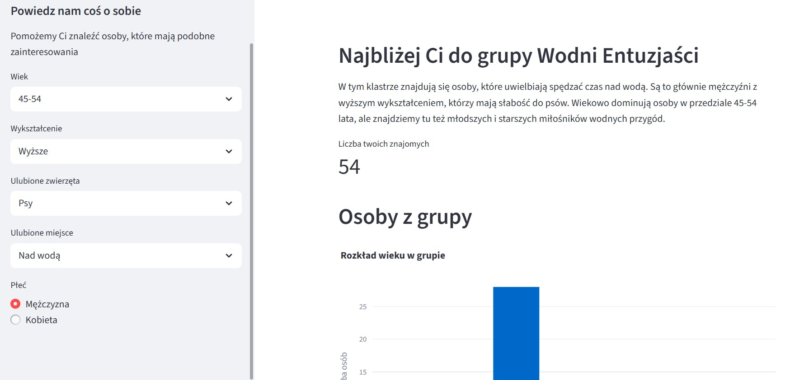
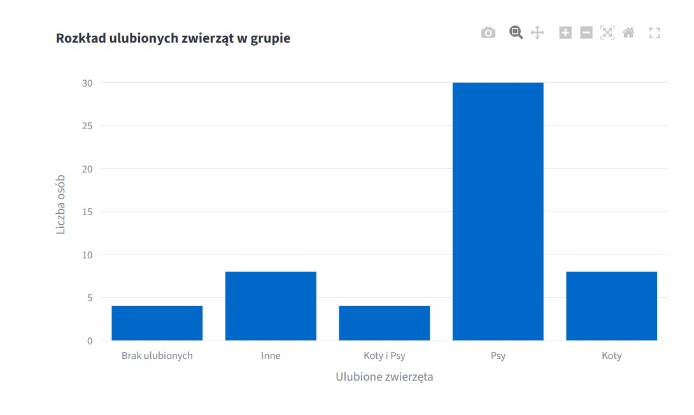
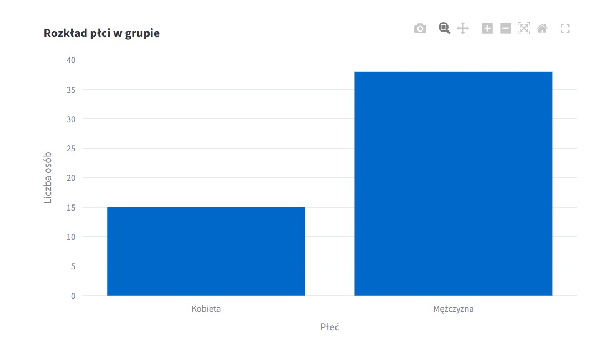

# Find Friends – Znajdź swoją grupę

**18-06-2025**

Find Friends to aplikacja do znajdowania osób o podobnych zainteresowaniach spośród uczestników kursu Data Science „Od zera do AI". Użytkownik podaje kilka informacji o sobie – wiek, wykształcenie, ulubione zwierzęta, miejsce i płeć – a aplikacja na podstawie algorytmu klasteryzacji przypisuje go do grupy osób o podobnym profilu. Opis każdej grupy generowany jest przez LLM.

Aplikacja ma na celu nie tylko techniczne zrozumienie, jak budować takie narzędzia, ale także pokazanie, jak można wykorzystać modele AI do tworzenia aplikacji, które mogą być użyteczne w rzeczywistych scenariuszach, takich jak znajdowanie osób o podobnych zainteresowaniach na kursie.

<a href="https://find-friends-v4-iborkowska.streamlit.app/" class="md-button md-button--primary" target="_blank">🚀 Otwórz aplikację</a>

---

## Jak to działa?

Użytkownik wypełnia krótki formularz. Aplikacja przypisuje go do najbliższego klastra i wyświetla opis grupy wygenerowany przez AI oraz liczbę osób w niej.

Dla każdej grupy prezentowane są wykresy pokazujące rozkład cech – tu ulubione zwierzęta członków grupy.

Kolejny wykres pokazuje rozkład płci w przypisanej grupie.

---

## Technologie

| Technologia | Zastosowanie |
|---|---|
| Python | język programowania |
| Streamlit | interfejs aplikacji |
| Scikit-learn | klasteryzacja (K-Means) |
| OpenAI GPT | generowanie opisów grup |
| Pandas | przetwarzanie danych |

---

## O danych

Dane pochodzą z anonimizowanej ankiety wypełnionej przez uczestników kursu. Aplikacja wykorzystuje algorytmy klasteryzacji do odkrywania grup o podobnych cechach, a LLM tworzy dla każdej grupy czytelny opis.