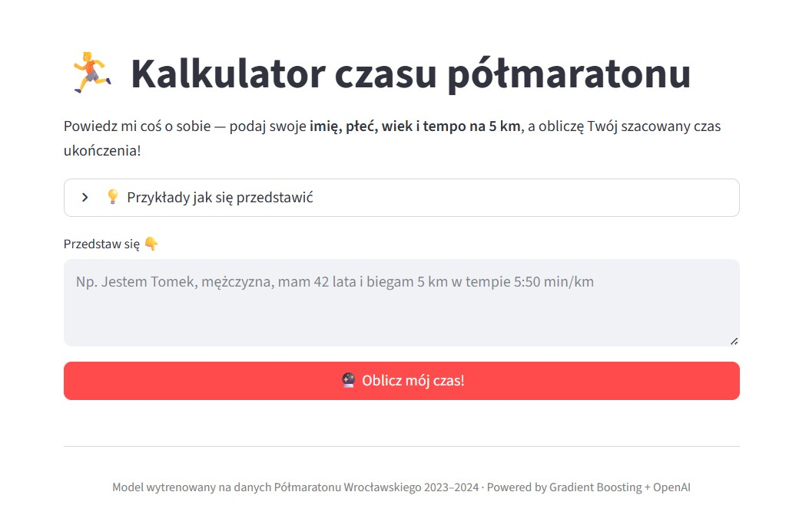
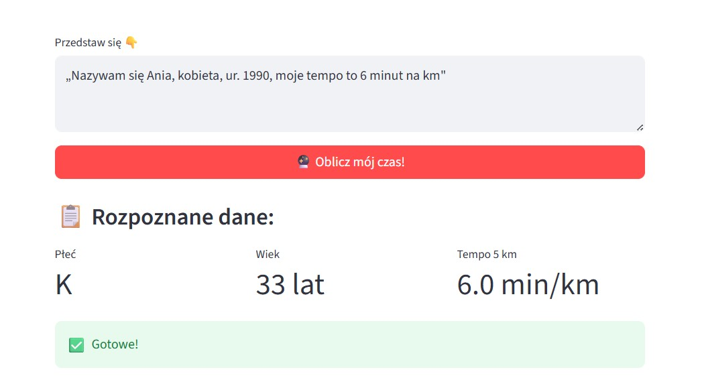
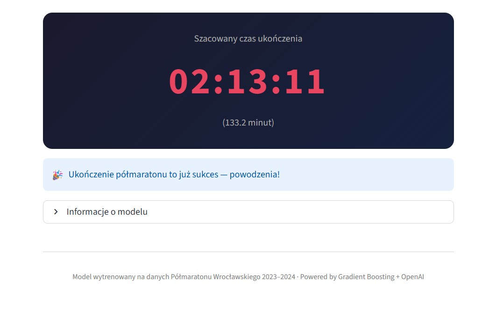

# 🏃 Kalkulator czasu półmaratonu

**20-04-2026**

Aplikacja szacująca czas ukończenia półmaratonu na podstawie danych biegacza. Wytrenowana na danych z Półmaratonu Wrocławskiego 2023 i 2024 (~18 000 wyników).

Użytkownik przedstawia się w naturalnym języku – podaje płeć, wiek i tempo na 5 km. Aplikacja używa OpenAI do wyłuskania danych z tekstu, a następnie modelu ML (Gradient Boosting) do przewidzenia czasu ukończenia.

<a href="https://halfmarathon-app-galjb.ondigitalocean.app/" class="md-button md-button--primary" target="_blank">🚀 Otwórz aplikację</a>

---

## Jak to działa?

Użytkownik wpisuje opis w naturalnym języku – bez formularzy, bez rozwijanych list.

OpenAI wyłuskuje z tekstu płeć, wiek i tempo, a model ML oblicza przewidywany czas.

Wynik prezentowany jest w czytelnej formie wraz z motywującym komunikatem.

---

## Technologie

| Technologia | Zastosowanie |
|---|---|
| Python | język programowania |
| Scikit-learn | trenowanie modelu ML |
| Streamlit | interfejs aplikacji |
| OpenAI GPT-4o-mini | wyłuskiwanie danych z tekstu |
| Langfuse | monitorowanie wywołań LLM |
| Digital Ocean Spaces | przechowywanie danych i modelu |
| Digital Ocean App Platform | hosting aplikacji |

---

## Wyniki modelu

- **MAE:** 303 sekundy (5.1 minuty)
- **R²:** 0.88