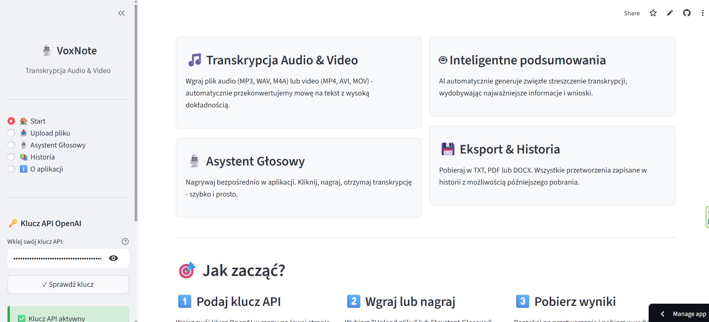
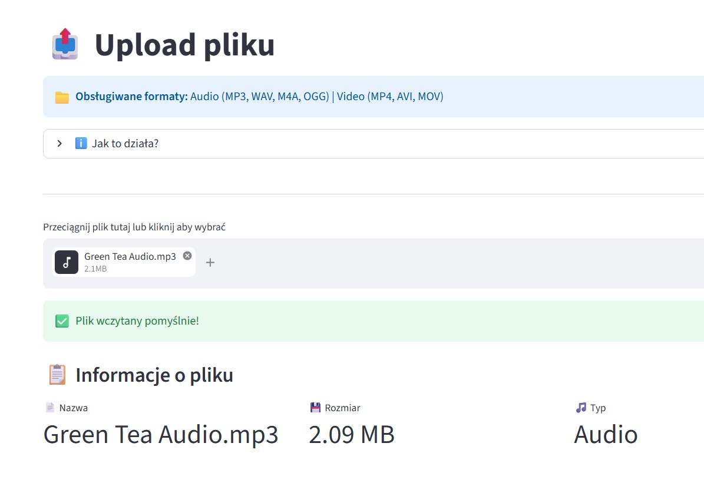
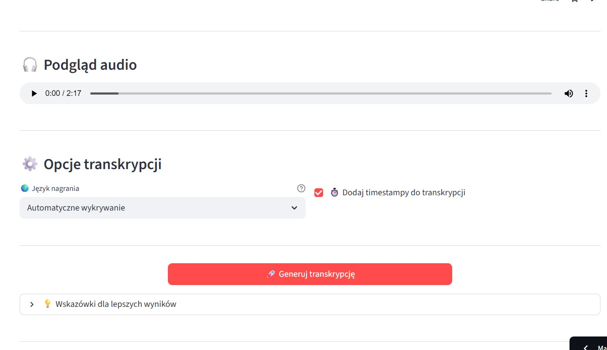
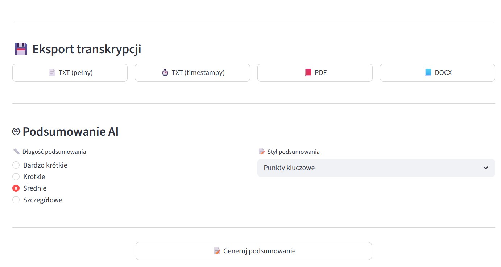
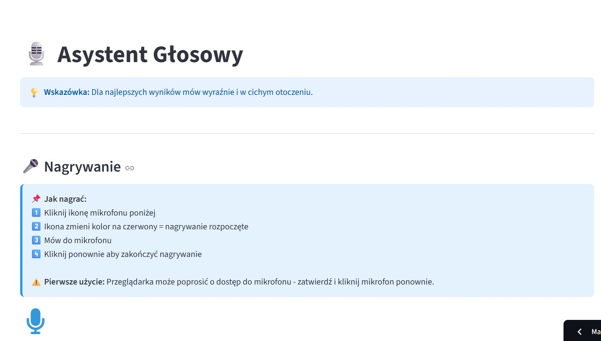
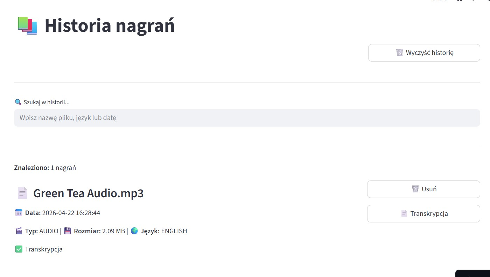

# 🎙️ VoxNote – Transkrypcja Audio & Video

**15-12-2025**

VoxNote to moja aplikacja do transkrypcji nagrań audio i wideo oraz automatycznego generowania podsumowań przy użyciu sztucznej inteligencji. Wgrywasz plik, aplikacja zamienia mowę na tekst i generuje zwięzłe podsumowanie. Powstała w ramach kursu Data Science „Od zera do AI".

<a href="https://voxnote.streamlit.app/" class="md-button md-button--primary" target="_blank">🚀 Otwórz aplikację</a>

---

## Jak to działa?

Po wejściu do aplikacji podajesz klucz API OpenAI. Aplikacja oferuje cztery główne funkcje: transkrypcję plików, asystenta głosowego, inteligentne podsumowania oraz historię nagrań z eksportem.

Wgrywasz plik audio (MP3, WAV, M4A, OGG) lub wideo (MP4, AVI, MOV) przeciągając go lub wybierając z dysku.

Przed generowaniem możesz ustawić język nagrania oraz zdecydować czy transkrypcja ma zawierać timestampy.

Gotowa transkrypcja wyświetlana jest w dwóch widokach – pełny tekst oraz wersja z timestampami.

Transkrypcję pobierzesz w formacie TXT, PDF lub DOCX. Możesz też wygenerować podsumowanie AI – krótkie, średnie lub szczegółowe.

Asystent głosowy pozwala nagrywać bezpośrednio w przeglądarce – bez potrzeby przygotowywania pliku.

Wszystkie przetworzenia zapisywane są w historii z możliwością późniejszego pobrania transkrypcji.

---

## Technologie

| Technologia | Zastosowanie |
|---|---|
| Python | język programowania |
| Streamlit | interfejs aplikacji |
| OpenAI Whisper | transkrypcja audio |
| OpenAI GPT-4o | generowanie podsumowań |
| Pydub | przetwarzanie audio |
| MoviePy | wyodrębnianie audio z wideo |
| ReportLab | generowanie PDF |
| python-docx | generowanie DOCX |

---

## Informacje

- **Koszt transkrypcji:** ~$0.006 za minutę audio
- **Maksymalny rozmiar pliku:** 25 MB (ograniczenie API)