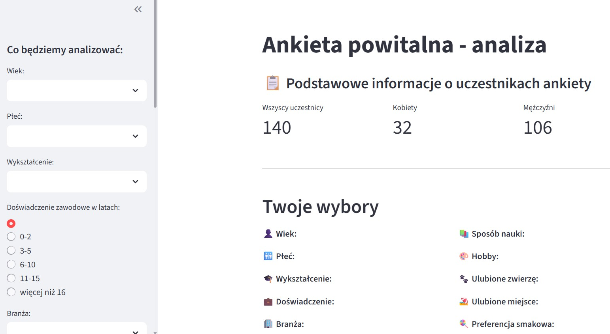
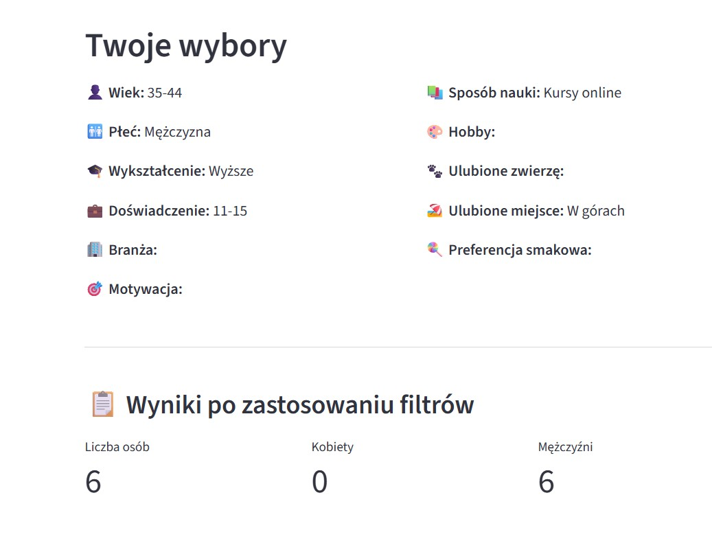
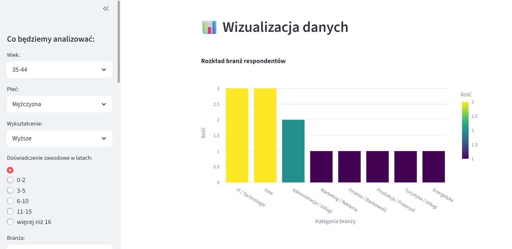

# 📋 Ankieta Powitalna – Analiza Danych

**10-05-2025**

Aplikacja do eksploracji danych z ankiety powitalnej wypełnionej przez uczestników kursu Data Science „Od zera do AI". Użytkownik filtruje dane według wybranych kryteriów – wieku, płci, wykształcenia, doświadczenia czy branży – i od razu widzi jak wygląda grupa osób o podobnym profilu.

<a href="https://github.com/IBorkowska/Aplikacja-Ankieta-Powitalna" class="md-button md-button--primary" target="_blank">📂 Zobacz kod na GitHub</a>

---

## Jak to działa?

Po wejściu do aplikacji widoczne są podstawowe statystyki ankiety – łączna liczba uczestników oraz podział na kobiety i mężczyzn. Po lewej stronie panel filtrów pozwala zawęzić wyniki.

Po ustawieniu filtrów aplikacja pokazuje podsumowanie wybranych kryteriów oraz liczbę osób spełniających dane warunki.

Wyniki prezentowane są w formie wykresów – tu rozkład branż wśród przefiltrowanych respondentów.

---

## Technologie

| Technologia | Zastosowanie |
|---|---|
| Python | język programowania |
| Streamlit | interfejs aplikacji |
| Pandas | filtrowanie i analiza danych |
| Plotly | wizualizacja danych |